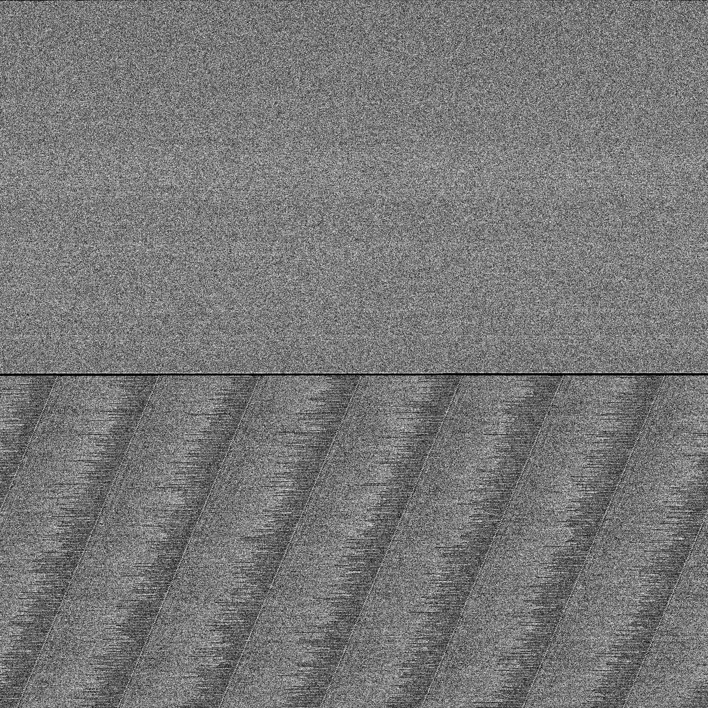
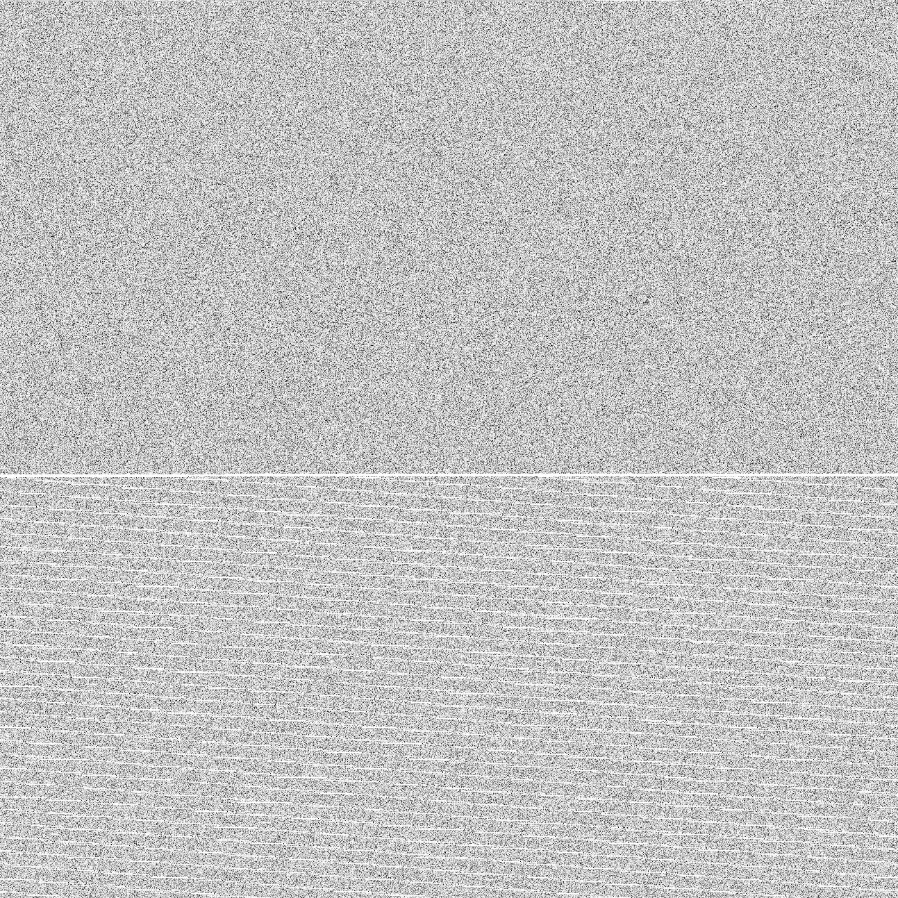
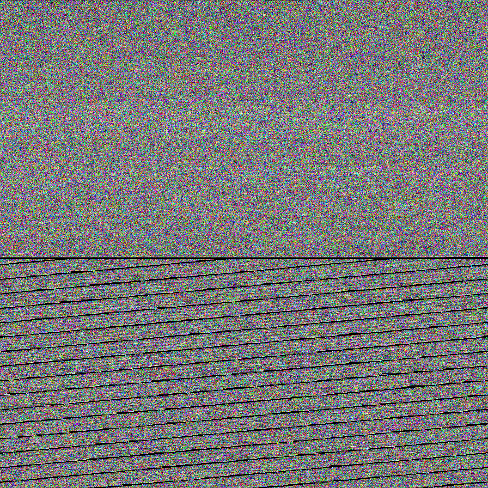
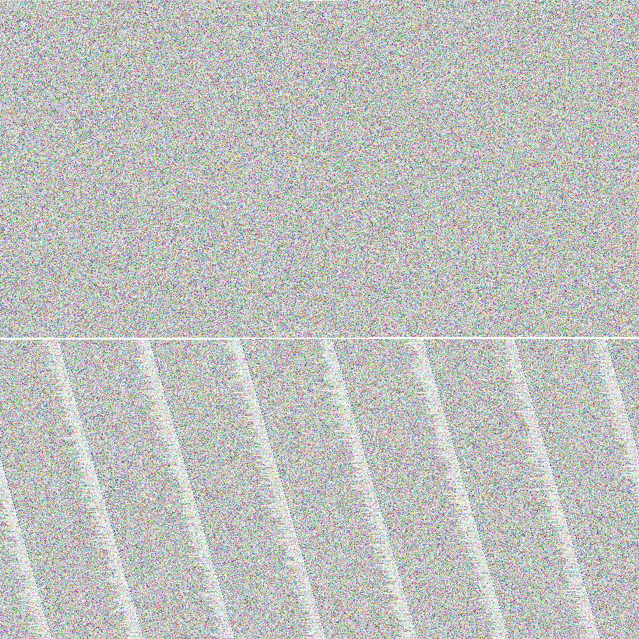

# pang
Generates square png files in one of 4 channel modes.

## Testing
`$ pangs input.foo` will generate all modes to current dir. You can change it with `$ pangs input.foo /some/output/path`.

Clean things up with: `$ pangs clean` or `$ pangs clean /some/output/path`

## Example
Files made out of mp3:
* grayscale `-g`

* grayscale + alpha `-ga`

* rgb (default)

* rgb + alpha `-a`

